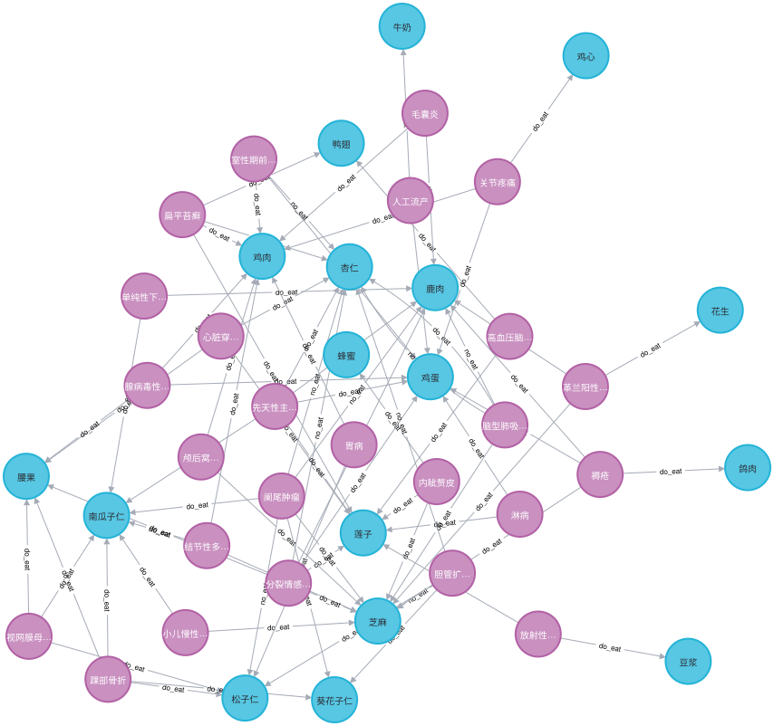
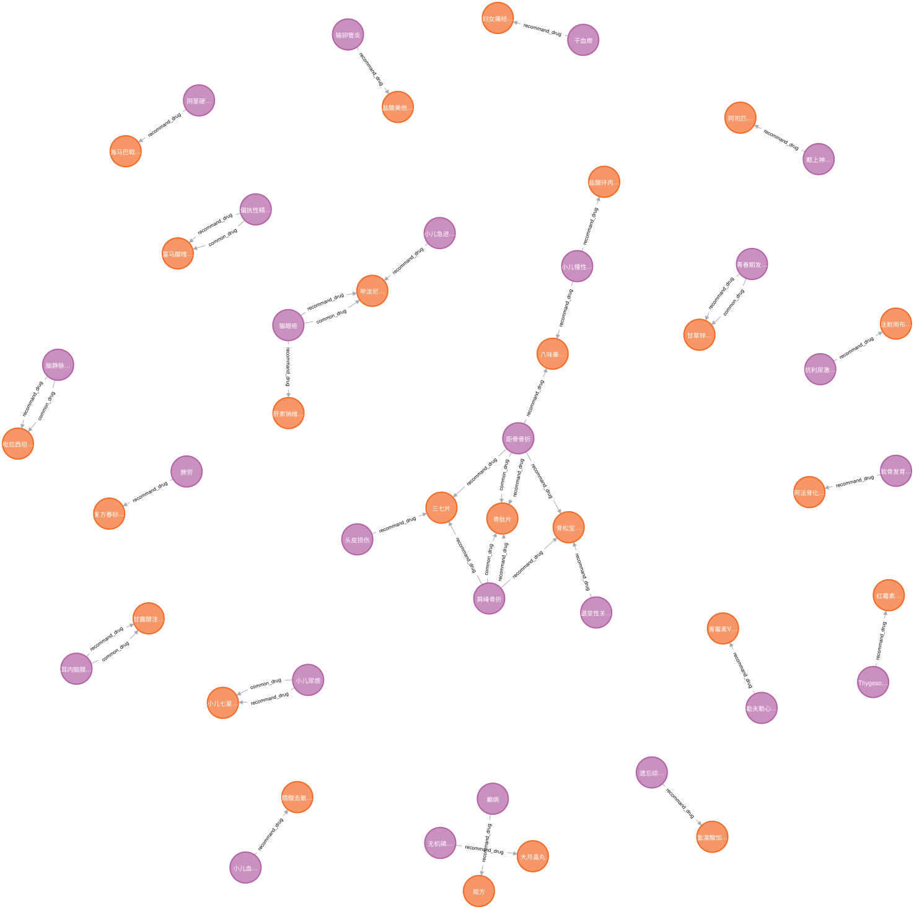
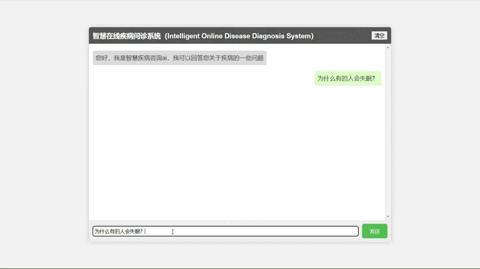

# 〇、目录
- [〇、目录](#〇目录)
- [一、项目介绍](#一项目介绍)
  - [1.项目目的](#1项目目的)
  - [2.项目背景](#2项目背景)
- [二、项目概要](#二项目概要)
  - [1.参考/借鉴项目](#1参考借鉴项目)
  - [2.项目环境](#2项目环境)
  - [3.使用语言](#3使用语言)
  - [4.目录结构及文件说明](#4目录结构及文件说明)
  - [5.医药领域知识图谱规模](#5医药领域知识图谱规模)
    - [5.1 neo4j图数据库存储规模（部分）](#51-neo4j图数据库存储规模部分)
    - [5.2 知识图谱实体类型](#52-知识图谱实体类型)
    - [5.3 知识图谱实体关系类型](#53-知识图谱实体关系类型)
    - [5.4 知识图谱属性类型](#54-知识图谱属性类型)
    - [5.5 支持问答类型](#55-支持问答类型)
- [三、项目效果与体验](#三项目效果与体验)
  - [1.项目效果](#1项目效果)
  - [2.体验地址](#2体验地址)
  - [3.部分问答结果展示](#3部分问答结果展示)


# 一、项目介绍
## 1.项目目的
 &emsp;&emsp;学校老师要求参加竞赛([2023中软卓越杯技术大赛>信息技术实践创新赛道](https://www.steertech.cn/#/contest/contestDetail?id=42))。
 
 &emsp;&emsp;为人们提供一个方便、快捷、准确的平台，帮助人们更好地了解和咨询自己的健康问题。该网站依托人工智能技术（知识图谱），能够迅速对用户提出的疑问进行诊断和分析，给出指导建议。通过该网站，人们可以更好地掌握自己的健康状况，及时预防和处理疾病，提高生活质量。

## 2.项目背景
&emsp;&emsp;随着社会经济的发展和人口老龄化趋势的加剧，人们对于医疗健康的需求日益增长，但传统医疗资源却难以满足广大人民群众  的需求。同时，医疗领域涉及知识广泛、专业性强、变化快等特点，也给医生和患者带来一定的困扰。因此，基于人工智能技术的智能疾病咨询网站应运而生。

# 二、项目概要
## 1.参考/借鉴项目
  * [liuhuanyong/QASystemOnMedicalKG](https://github.com/liuhuanyong/QASystemOnMedicalKG)（借鉴部分代码，且对部分代码进行了优化）
## 2.项目环境
  * python
  * neo4j
## 3.使用语言
  * python
  * html
  * CSS
  * JavaScript

## 4.目录结构及文件说明
```
Intelligent_Disease_Consultation_web/
├── data/
│   ├── medical_50.json
│   └── medical.json
├── img/
├── log/
├── neo4j_db/
│   ├── answer_search.py
│   ├── chatbot_graph.py
│   ├── import_data_to_neo4j.py
│   ├── question_classifier.py
│   └── question_parser.py
├── web/
│   ├── plugins/
│   │   ├── api.py
│   │   ├── index.py
│   │   └── resource.py
│   └── templates/
├── config.py
├── log_ger.py
├── main.py
├── README.md
└── requirements.py
```

- `data/`：数据文件夹，包含与项目相关的数据文件。
  - `medical.json`：医疗知识库文件。
  - `medical_50.json`：医疗知识库文件(50条数据)。
- `img/`：项目相关图片。
- `log/`：日志文件夹，存放项目生成的日志文件。（默认不存在）
- `neo4j_db/`：Neo4j图数据库相关文件夹，项目中使用Neo4j作为知识库。
  - `answer_search.py`：实现问题答案查找功能。
  - `chatbot_graph.py`：问答程序脚本。
  - `import_data_to_neo4j.py`：将数据导入neo4j数据库（知识图谱数据导入）。
  - `question_classifier.py`：问句类型分类脚本。
  - `question_parser.py`：问句解析脚本。
- `web/`：Web应用的代码文件夹。
  - `plugins/`：一些针对API相关的插件模块。
    - `api.py`：实现API调用的Python模块。
    - `index.py`：应用的主要逻辑。
    - `resource.py`：资源获取模块。
  - `templates/`：模板文件夹，存放Web应用的HTML模板文件。
- `config.py`：配置文件，存放与应用相关的配置信息。
- `log_ger.py`：日志系统的Python模块。
- `main.py`：应用的主程序，它将启动Web应用。
- `README.md`：项目的简要说明文件。
- `requirements.py`：项目所需的Python库及其版本的列表文件。

## 5.医药领域知识图谱规模
### 5.1 neo4j图数据库存储规模（部分）
do_eat:

recommand_drug:



### 5.2 知识图谱实体类型
> 以下是医疗知识图谱实体类型及其相关信息，数据来源于[liuhuanyong/QASystemOnMedicalKG 的 README.md](https://github.com/liuhuanyong/QASystemOnMedicalKG/blob/master/README.md):

| 实体类型 | 中文含义 | 实体数量 |举例 |
| :--- | :---: | :---: | :--- |
| Check | 诊断检查项目 | 3,353| 支气管造影;关节镜检查|
| Department | 医疗科目 | 54 |  整形美容科;烧伤科|
| Disease | 疾病 | 8,807 |  血栓闭塞性脉管炎;胸降主动脉动脉瘤|
| Drug | 药品 | 3,828 |  京万红痔疮膏;布林佐胺滴眼液|
| Food | 食物 | 4,870 |  番茄冲菜牛肉丸汤;竹笋炖羊肉|
| Producer | 在售药品 | 17,201 |  通药制药青霉素V钾片;青阳醋酸地塞米松片|
| Symptom | 疾病症状 | 5,998 |  乳腺组织肥厚;脑实质深部出血|
| Total | 总计 | 44,111 | 约4.4万实体量级|

### 5.3 知识图谱实体关系类型
> 以下是医疗知识图谱实体类型及其相关信息，数据来源于[liuhuanyong/QASystemOnMedicalKG 的 README.md](https://github.com/liuhuanyong/QASystemOnMedicalKG/blob/master/README.md):

| 实体关系类型 | 中文含义 | 关系数量 | 举例|
| :--- | :---: | :---: | :--- |
| belongs_to | 属于 | 8,844| <妇科,属于,妇产科>|
| common_drug | 疾病常用药品 | 14,649 | <阳强,常用,甲磺酸酚妥拉明分散片>|
| do_eat |疾病宜吃食物 | 22,238| <胸椎骨折,宜吃,黑鱼>|
| drugs_of |  药品在售药品 | 17,315| <青霉素V钾片,在售,通药制药青霉素V钾片>|
| need_check | 疾病所需检查 | 39,422| <单侧肺气肿,所需检查,支气管造影>|
| no_eat | 疾病忌吃食物 | 22,247| <唇病,忌吃,杏仁>|
| recommand_drug | 疾病推荐药品 | 59,467 | <混合痔,推荐用药,京万红痔疮膏>|
| recommand_eat | 疾病推荐食谱 | 40,221 | <鞘膜积液,推荐食谱,番茄冲菜牛肉丸汤>|
| has_symptom | 疾病症状 | 5,998 |  <早期乳腺癌,疾病症状,乳腺组织肥厚>|
| acompany_with | 疾病并发疾病 | 12,029 | <下肢交通静脉瓣膜关闭不全,并发疾病,血栓闭塞性脉管炎>|
| Total | 总计 | 294,149 | 约30万关系量级|

### 5.4 知识图谱属性类型
> 以下是医疗知识图谱实体类型及其相关信息，数据来源于[liuhuanyong/QASystemOnMedicalKG 的 README.md](https://github.com/liuhuanyong/QASystemOnMedicalKG/blob/master/README.md):

| 属性类型 | 中文含义 | 举例 |
| :--- | :---: | :---: |
| name | 疾病名称 | 喘息样支气管炎 |
| desc | 疾病简介 | 又称哮喘性支气管炎... |
| cause | 疾病病因 | 常见的有合胞病毒等...|
| prevent | 预防措施 | 注意家族与患儿自身过敏史... |
| cure_lasttime | 治疗周期 | 6-12个月 |
| cure_way | 治疗方式 | "药物治疗","支持性治疗" |
| cured_prob | 治愈概率 | 95% |
| easy_get | 疾病易感人群 | 无特定的人群 |

### 5.5 支持问答类型
> 以下是医疗知识图谱实体类型及其相关信息，数据来源于[liuhuanyong/QASystemOnMedicalKG 的 README.md](https://github.com/liuhuanyong/QASystemOnMedicalKG/blob/master/README.md):

| 问句类型 | 中文含义 | 问句举例 |
| :--- | :---: | :---: |
| disease_symptom | 疾病症状| 乳腺癌的症状有哪些？ |
| symptom_disease | 已知症状找可能疾病 | 最近老流鼻涕怎么办？ |
| disease_cause | 疾病病因 | 为什么有的人会失眠？|
| disease_acompany | 疾病的并发症 | 失眠有哪些并发症？ |
| disease_not_food | 疾病需要忌口的食物 | 失眠的人不要吃啥？ |
| disease_do_food | 疾病建议吃什么食物 | 耳鸣了吃点啥？ |
| food_not_disease | 什么病最好不要吃某事物 | 哪些人最好不好吃蜂蜜？ |
| food_do_disease | 食物对什么病有好处| 鹅肉有什么好处？ |
| disease_drug | 啥病要吃啥药 | 肝病要吃啥药？ |
| drug_disease | 药品能治啥病 | 板蓝根颗粒能治啥病？ |
| disease_check | 疾病需要做什么检查 | 脑膜炎怎么才能查出来？|
| check_disease |　检查能查什么病 | 全血细胞计数能查出啥来？ |
| disease_prevent | 预防措施| 怎样才能预防肾虚？ |
| disease_lasttime | 治疗周期 | 感冒要多久才能好？ |
| disease_cureway | 治疗方式 | 高血压要怎么治？ |
| disease_cureprob | 治愈概率 | 白血病能治好吗？ |
| disease_easyget | 疾病易感人群 | 什么人容易得高血压？ |
| disease_desc | 疾病描述 | 糖尿病 |

# 三、项目效果与体验
## 1.项目效果


## 2.体验地址
 &emsp;&emsp;[体验地址：https://iodds.qianlima.fun/](https://iodds.qianlima.fun/)

## 3.部分问答结果展示
    user：感冒要多久才能好？
    ai：感冒治疗可能持续的周期为：7-14天

    user：白血病能治好吗？
    ai： 白血病治愈的概率为（仅供参考）：50%-70%

    user：感冒
    ai：感冒,熟悉一下：感冒，总体上分为普通感冒和流行性感冒，在这里先讨论普通感冒。普通感冒，祖国医学称"伤风"，是由多种病毒引起的一种呼吸道常见病，其中30%-50%是由某种血清型的鼻病毒引起，普通感冒虽多发于初冬，但任何季节，如春天，夏天也可发生，不同季节的感冒的致病病毒并非完全一样。流行性感冒，是由流感病毒引起的急性呼吸道传染病。病毒存在于病人的呼吸道中，在病人咳嗽，打喷嚏时经飞沫传染给别人。流感的传染性很强，由于这种病毒容易变异，即使是患过流感的人，当下次再遇上流感流行，他仍然会感染，所以流感容易引起暴发性流行。一般在冬春季流行的机会较多，每次可能有20～40%的人会传染上流感。

    user：板蓝根颗粒能治啥病？
    ai：板蓝根颗粒主治的疾病有锁喉痈；过敏性咽炎；喉返神经损伤；咽喉痛；慢性单纯性咽炎；先天性喉裂；慢性化脓性腮腺炎；化脓性腮腺炎；喉炎；咽部异感症；萎缩性咽炎；喉血管瘤；鼻咽炎；急性舌扁桃体炎；急性扁桃体炎；流行性腮腺炎；急性咽炎；梅核气；急性喉炎；腮腺隙感染,可以试试

    user：哪些人最好不好吃蜂蜜？
    ai：患有全身性特发性毛细血管扩张症；糖尿病合并低血糖；柯萨奇病毒疹；感染性血小板减少性紫癜；髋关节前脱位；胆汁性腹膜炎；血栓形成；腓总神经损伤；肠系膜脂肪炎；肠道短路关节炎皮炎综合征；小儿腹胀；颅内脂肪瘤；良性脂肪母细胞瘤；器械性食管损伤；α-贮存池病；化脓性甲沟炎；毒瘾；呼吸道合胞病毒感染；遗传性痉挛性截瘫；回旋形线状鱼鳞病的人最好不要吃蜂蜜

    user：人为什么会失眠？
    ai：失眠可能的成因有：躯体疾病和服用药物可以影响睡眠，如消化不良，头痛，背痛，关节炎，心脏病，糖尿病，哮喘，鼻窦炎，溃疡病，或服用某些影响中枢神经的药物。\n由于生活方式引起睡眠问题也很常见，如饮用咖啡或茶叶，晚间饮酒，睡前进食或晚饭较晚造成满腹食物尚未消化，大量吸烟，睡前剧烈的体力活动，睡前过度的精神活动，夜班工作，白天小睡，上床时间不规律，起床时间不规律。\n可能的原因有压力很大，过度忧虑，紧张或焦虑，悲伤或抑郁，生气，容易出现睡眠问题。\n吵闹的睡眠环境，睡眠环境过于明亮，污染，过度拥挤。